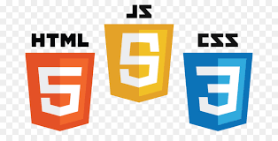

<h1 align="center">Aulas de Idioma</h1>

# Índice 
* [Índice;](#índice)
* [Descrição do Projeto;](#descrição-do-projeto)
* [Status do Projeto](#status-do-projeto)
* [Tecnologias utilizadas;](#tecnologias-utilizadas)
* [Pessoas Contribuidoras;](#pessoas-contribuidoras)
* [Pessoas Desenvolvedoras do Projeto;](#pessoas-desenvolvedoras-do-projeto)
* [Conclusão;](#conclusão)
* [Nota;](#nota)

# Descrição do Projeto

Projeto de um curso da freeCodeCamp. A tarefa do projeto é Build a Product Landing Page. Fiz a construção do HTML e CSS, na época em que realizei essa atividade. Pórem tempos depois decidi atualizar, colocar o conhecimento adquirido em outros modulos de outros cursos, modifiquei parte do HTML e boa parte do css, e criei um pequeno grupo de funções para melhorar a responsividade, que aprendi depois como funciona. E uma página destinada a apresentar uma possível solução para pessoas que querem aprender um novo idioma. Juntei conteúdos na Web, que me facilitaram no caminho ao aprendizado do ingles, e nessa página escrevo o caminho que passei, e o possível caminho que poderão passar aqueles que querem aprender.

# Status do Projeto
<h4 align="center">🆗Projeto finalizado 🆗 </h4>

# Tecnologias utilizadas

HTML 5, CSS3, JavaScript

# Pessoas contribuidoras

Alysson, freeCodeCamp, canais no youtube(SmallAdvantages, English for Everyone with Kevin and Liza, Learn English with EnglishClass101.com, English in Brazil by Carina Fragozo, Inglês em alguns minutos, Ana Gomes)

# Pessoas Desenvolvedoras do Projeto

Made by ☺Alysson☻ 15/07/2024

# Conclusão

Desenvolver pequenos projetos assim, colocar em prática as informações adquiridas, revisando conteúdo, nos motiva a continuar o aprendizado.

# Nota

Acesse minhas redes sociais no rodapé da página da aplicação.

